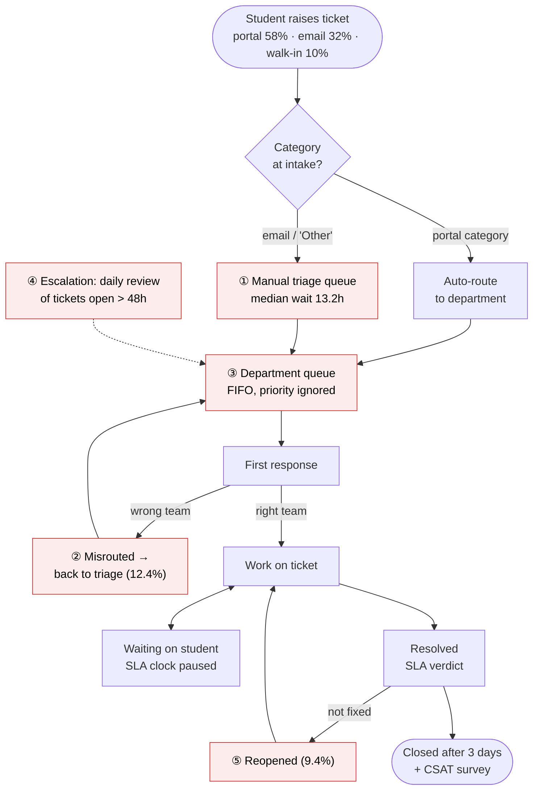
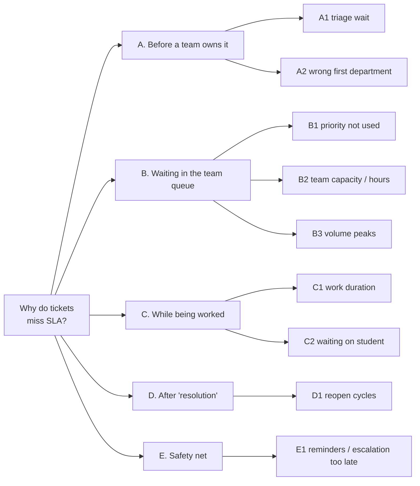
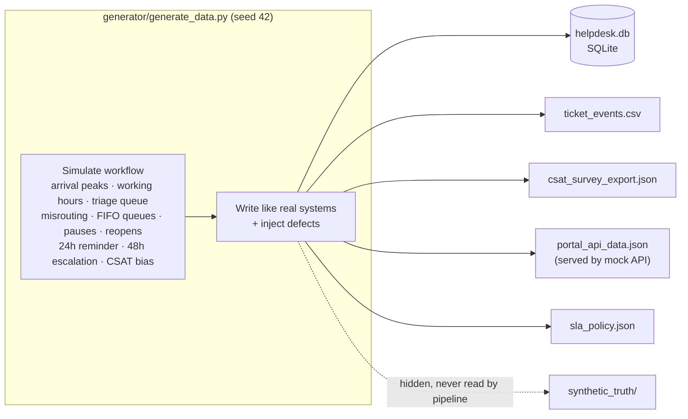
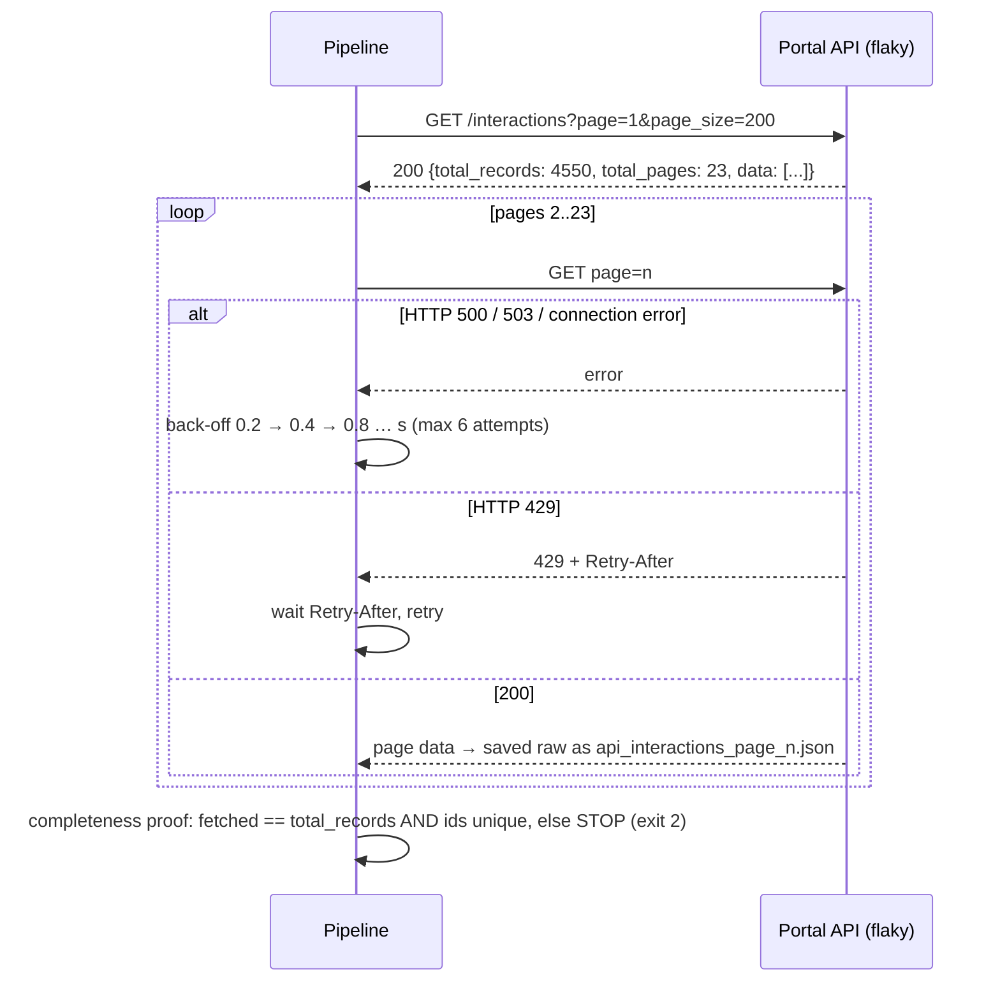
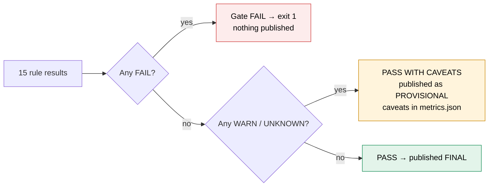
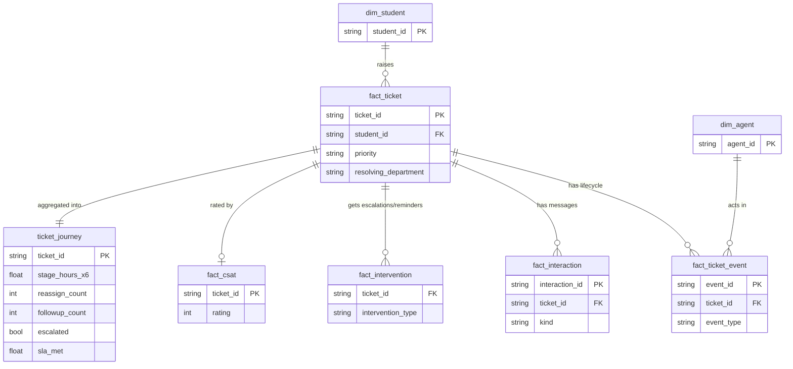
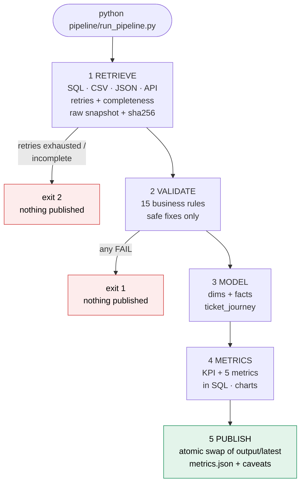
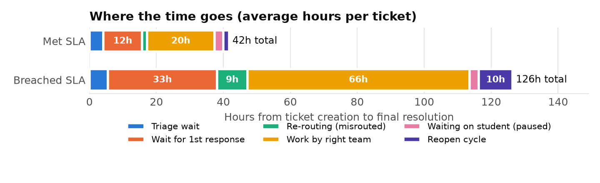
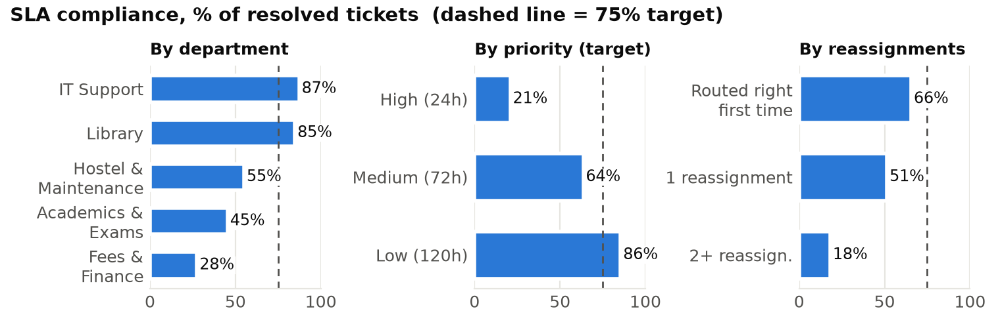
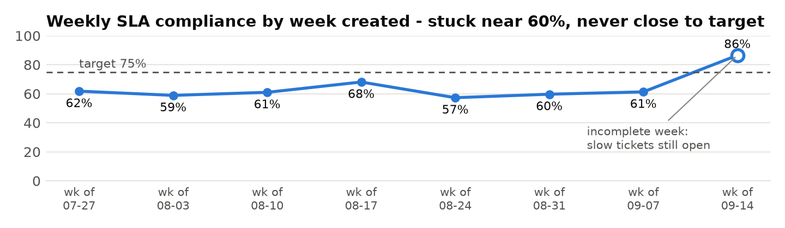

# CampusDesk: from an ambiguous problem to a dependable data workflow

[](https://github.com/LAKSHYAMEWARA0025/campusdesk-fde-assignment/actions/workflows/pipeline.yml)

**FDE Assignment (Classes 1–8) · Lakshya Mewara · Roll No. 24bcs10290 · Batch 2024-28**

| | |
|---|---|
| 📄 Submission PDF (2 pages) | [`report/CampusDesk_FDE_Submission_Lakshya_Mewara.pdf`](report/CampusDesk_FDE_Submission_Lakshya_Mewara.pdf) |
| 📓 Executed notebook | [`notebooks/CampusDesk_FDE_Walkthrough.ipynb`](notebooks/CampusDesk_FDE_Walkthrough.ipynb) |
| ⚙️ Pipeline artifact | [`logs/`](logs) · [`output/latest/`](output/latest) · [validation report](output/latest/validation_report.md) · [CI runs](https://github.com/LAKSHYAMEWARA0025/campusdesk-fde-assignment/actions) |
| 📚 Detailed report (optional) | [`docs/CampusDesk_Full_Report.pdf`](docs/CampusDesk_Full_Report.pdf) |
| 🎬 5-min demo | link in the submission PDF · script in [`docs/DEMO_SCRIPT.md`](docs/DEMO_SCRIPT.md) |

> **TL;DR.** The Dean wanted to buy an AI chatbot because "helpdesk tickets take forever". The data shows the delay isn't in answering students. It's in **routing, queueing and escalation**.
> SLA compliance is **63.1%**, and only **21%** for High priority. Misrouted tickets drop from **66% → 18%** on time, and escalation happens at a median of **65h**.
> Fixing routing and escalation inside the current tool is estimated to reach about **79%** (target 75%). **Don't buy the chatbot yet: pilot these fixes first.**

This README is organised by the assignment's 8 skill areas (§1–§8), followed by findings, how to run the code, and the repo layout.

---

## §1 FDE mindset & stakeholders

The request was a **solution** ("buy an AI chatbot"), not a problem. Following the FDE loop (*Listen → Observe → Question → Structure → Validate → Build → Measure → Iterate*), I first asked who is affected, who owns the problem, and what "takes forever" means in data.

| Stakeholder | Role | Goal | Constraint | Key discovery question |
|---|---|---|---|---|
| **Dean of Student Affairs** | Sponsor, **owns the KPI** | Fewer complaints; a defensible call on the chatbot budget | Must improve before end-sem exams | What would convince you the helpdesk improved? |
| **Helpdesk Manager** | Operational owner | Hit SLAs with current staff | No new hires; tool is fixed | When do you escalate? Are priorities used in queues? |
| **Triage coordinators (2)** | Route email / "Other" tickets | Route fast and correctly | Mon–Sat 9–18, no Sunday cover | Why do tickets bounce back? |
| **Department agents** (IT, Hostel, Finance, Academics, Library) | Resolve tickets | Only receive their own tickets | Finance and Academics work Mon–Fri 9–17 | How do you pick the next ticket? |
| **Students** | Affected users | Quick, first-time-right fix | Exam and move-in peaks | What made you follow up or reopen? |
| **IT admin** | Owns ticketing data | Keep the tool stable | Read-only access for us | Which export is authoritative for timestamps? |

| Facts (verified in data) | Assumptions (need owner confirmation) | Unknowns (can't get from data) |
|---|---|---|
| 1,230 tickets in 8 weeks; 3 intake channels | SLA clock pauses while "Waiting on Student" | **Why** tickets get misrouted (no reason code) |
| Draft SLA: High 24h / Medium 72h / Low 120h | SLA runs to the **final** resolution (after reopens) | Real agent effort (no time tracking) |
| Email tickets have no category, so they go to manual triage | Missing priority (email) = Medium, per the policy default | Causal effect of escalation |
| Escalation = daily 10:00 review of tickets open >48h | "Exam Cell" = Academics & Exams, "Hostel" = Hostel & Maintenance | Calendar vs business-hours SLA not decided |
| Auto-reminder to the agent after 24h without a reply | Cancelled and no-reply closures are excluded from the KPI | Views of students who don't answer CSAT |

---

## §2 Workflow & problem structure

### Current-state workflow (red = where the problem appears)



**Before the problem:** intake and categorisation decide the first queue. **After it:** students chase with "any update?" follow-ups, reopen tickets and give low CSAT.

### Issue tree: "Why do tickets miss SLA?" (MECE by workflow stage)



These branches are mutually exclusive and collectively exhaustive **by construction**. The model splits every ticket's total time into triage + first-response wait + re-routing + work + waiting-on-student + reopen cycle, and the code checks that they add up exactly (max gap 0.00h).

### Hypotheses and verdicts

| Hypothesis | Verdict | Evidence |
|---|---|---|
| H1 Misrouting drives breaches | ✅ Supported | SLA 66% (0 hops) → 51% (1) → 18% (2+) |
| H1b Manual triage alone drives breaches | 🟡 Partly | Waits 13.2h, but SLA 61% vs 65% auto-routed |
| H2 Priority not used in queueing | ✅ Supported | First response High 19.3h ≈ Low 16.3h; High SLA 21% |
| H3 Capacity / hours-constrained teams | ✅ Supported | Finance 28%, Academics 45% vs IT 87% |
| H4 Escalation too late | ✅ Supported | Median 65h; 132 escalated after breaching |
| H5 Weekend tickets are the main problem | 🟡 Minor | Weekend 56% vs weekday 65% (a secondary driver) |

### SMART problem statement
> Only **63%** of student helpdesk tickets resolved between 27 Jul and 20 Sep 2026 met their priority SLA (High 24h / Medium 72h / Low 120h), and only **21%** of High-priority tickets did.
> **Identify where in the ticket workflow delay accumulates** and implement the highest-impact process fixes to raise SLA compliance to **≥75%** (High ≥50%) **within 8 weeks**, using the **existing helpdesk team and current ticketing tool**.

---

## §3 KPIs, scope & solution

| Metric | Definition | Type | Baseline |
|---|---|---|---:|
| **KPI: SLA compliance rate** | resolved tickets whose *net* time (creation → **final** resolution, minus "Waiting on Student") ≤ priority target ÷ resolved tickets | Lagging outcome | **63.1%** (675/1,069) |
| M1 Median first-response time | median(first_response − created) | Leading driver | 17.9h |
| M2 Median manual-triage wait | median(first_assigned − created), manual tickets | Leading driver | 13.2h |
| M3 Reassignment rate | % tickets with ≥1 reassignment | Leading driver | 12.4% |
| M4 Reopen rate | % resolved tickets reopened | Quality guardrail | 9.4% |
| M5 Average CSAT | mean of the latest valid rating per ticket | Student outcome | 3.69 (36.5% response) |
| Guardrail: High-priority SLA | as KPI, High priority only | Lagging | 21% |

| MVP scope (in) | Out of scope |
|---|---|
| All tickets from portal, email and walk-in, 27 Jul – 20 Sep 2026 | Building or buying the chatbot (revisit after the pilot) |
| Full lifecycle from the audit log, interactions from the API, CSAT | Hiring and staffing; agent-level performance ranking |
| Where delay accumulates; sizing of process fixes | Real-time queue dashboard (data is a daily batch) |
| Repeatable pipeline with a validation gate and logs | Changing the ticketing tool's code |

**Success means:** a KPI of ≥75% and High-priority ≥50% on the **same, signed-off definition**, with reassignment rate and first-response time falling and the reopen rate not rising. Leading indicators are read within 2 weeks of the pilot.

---

## §4 Client data & source systems

**Data choice: synthetic, realistic, reproducible.** Real student-helpdesk data is private, so [`generator/generate_data.py`](generator/generate_data.py) (seed 42) **simulates the workflow**. It then writes the data the way real systems would hold it, **with realistic defects injected**.



**Injected defects:** exact duplicate rows and double submissions · `DD/MM/YYYY` vs ISO dates · 20 spellings of 5 categories and 11 of 6 statuses · missing priority on about a third of email tickets · stale denormalised `resolved_at` · duplicate and orphan audit events · walk-in desk clock skew · CSAT with 4 ticket-ref formats, string ratings, out-of-range values and resubmissions · API pagination with random HTTP 500 / 429.

### Source map and source-of-truth decisions

| Information needed | Where it lives | Type | Source-of-truth decision |
|---|---|---|---|
| Ticket header: student, channel, category, priority, subject | `helpdesk.db :: tickets` (1,254 rows) | **SQL** | SoT for header fields |
| Student attributes / agents | `helpdesk.db :: students` (1,800), `agents` (15) | **SQL** | SoT (names and emails not pulled) |
| **All lifecycle timestamps** + interventions | `ticket_events.csv` (7,849 rows) | **CSV** | **SoT for times** (the ticket table's `resolved_at` is stale) |
| Student follow-ups, agent replies | Portal API `GET /api/v1/interactions` (4,550 records, 23 pages) | **REST API** | SoT for interactions |
| Satisfaction 1–5 | `csat_survey_export.json` (424 responses, nested) | **JSON** | Directional only |
| SLA targets and rules | `sla_policy.json` | **JSON** | **Draft, not signed off** |

<details><summary><b>Source database schema: <code>source_systems/helpdesk.db</code></b></summary>

| Table | Columns |
|---|---|
| `tickets` (no PK: a legacy import table) | ticket_id, student_id, channel, category, priority, subject, created_at, status, current_department, resolved_at, last_updated_at |
| `students` | student_id (PK), full_name, program, year, hostel_block, email |
| `agents` | agent_id (PK), agent_name, department, role, active |

`ticket_events.csv`: event_id, ticket_id, event_time, event_type (created / assigned / first_response / agent_response / reassigned / status_change / reminder_sent / escalated), actor_id, from_status, to_status, department, note
</details>

### Important missing data / events
| Missing | Why it matters | Instrument next |
|---|---|---|
| Reassignment reason code | We see *that* tickets bounce, not *why* | Mandatory drop-down on reassign |
| "Started work" event / time spent | "Work" time mixes queueing and effort | "Start work" status + effort field |
| Priority on email tickets | 129 resolved tickets use a defaulted SLA target | Importer maps priority |
| Student confirmation of fix | Reopens are only noticed when the student complains | "Did this fix it?" before closing |

---

## §5 Retrieval: four source types, reproducible, raw preserved

[`pipeline/retrieve.py`](pipeline/retrieve.py) pulls every source into an **immutable raw snapshot** `data/raw/<run_id>/`, with a `_manifest.json` recording rows and sha256 per file. SQL is opened **read-only**, and only the needed columns are pulled.



The mock API ([`api/mock_portal_api.py`](api/mock_portal_api.py), standard library only) is seeded to fail about 15% of requests with 500 and about 7% with 429. In the committed run, **14 transient failures were retried and all 4,550 records were proven complete** ([`logs/pipeline_demo_run.log`](logs/pipeline_demo_run.log)).

---

## §6 Profiling & cleaning

[`pipeline/validate.py`](pipeline/validate.py) profiles the raw snapshot, then tests **15 business rules**. Each rule is a business assumption, and each gets a status:

- **PASS**: the assumption holds.
- **WARN**: handled and disclosed.
- **FAIL**: the metric would be misleading, so the pipeline stops.
- **UNKNOWN**: only a business owner can decide.



| # | Business rule | Status (latest run) |
|---|---|---|
| R01 | Every source returned data; the API returned all records | PASS |
| R02 | One row = one ticket (ticket_id unique) | WARN: 24 exact duplicates dropped |
| R03 | A repeat submission of the same issue isn't counted twice | PASS: all 22 already Cancelled |
| R04 | created_at is a valid timestamp | WARN: 200 DD/MM rows parsed |
| R05 | Every audit event belongs to a known ticket | WARN: 40 orphans quarantined, 77 duplicates dropped |
| R06 | Every ticket has a lifecycle; both systems agree on created_at | PASS: 100% coverage, 99.3% agree |
| R07 | Nothing happens before "created" | WARN: 8 walk-in tickets (clock skew) excluded |
| R08 | Each ticket maps to one canonical category | WARN: semantic mappings flagged to the owner |
| R09 | Every status maps to a known state | PASS |
| R10 | Every ticket has a priority | WARN: 145 email tickets defaulted to Medium |
| R11 | Tickets → students, interactions → tickets | PASS: 100% |
| R12 | Ticket-table `resolved_at` = final resolution in the audit log | WARN: 99 hold the *first* fix, so the audit log is used |
| R13 | One valid 1–5 CSAT per ticket | WARN: refs normalised, invalid dropped, latest kept |
| R14 | Data is fresh enough for the decision | PASS for weekly reporting (not for a live dashboard) |
| R15 | SLA definition agreed by the KPI owner | **UNKNOWN**: the Dean must sign off |

Full evidence per rule: [`output/latest/validation_report.md`](output/latest/validation_report.md).

**Safe fixes** (representation only): exact duplicates dropped, both date formats parsed, category and status casing normalised, CSAT refs and ratings normalised.
**Deliberately *not* cleaned by instinct:** possible double submissions (they could be genuine), semantic category mappings ("Exam Cell"), clock-skewed tickets (excluded, not guessed), missing priority (defaulted, plus a sensitivity check), and the stale `resolved_at` (ignored, reported to the IT admin).

---

## §7 Workflow model with data

[`pipeline/model.py`](pipeline/model.py) reorganises source-shaped data around the **ticket's journey**. It covers entities, events, interactions, interventions and outcomes, and writes them to `output/latest/warehouse.db`.



| Table | Grain | Rows |
|---|---|---:|
| `dim_student` / `dim_agent` | 1 per student / agent | 1,800 / 15 |
| `fact_ticket` | 1 per business ticket (deduped) | 1,230 |
| `fact_ticket_event` | 1 per lifecycle event | 7,732 |
| `fact_interaction` | 1 per portal message | 4,550 |
| `fact_intervention` | 1 per escalation / reminder | 853 |
| `fact_csat` | 1 per rated ticket (latest valid) | 394 |
| **`ticket_journey`** | **1 per ticket** (44 columns) | 1,230 |

One-to-many tables are **aggregated before joining** to keep the grain. All metrics are computed **in SQL** ([`pipeline/metrics.py`](pipeline/metrics.py)), with a custom `MEDIAN` aggregate registered on SQLite:

```sql
SELECT CASE WHEN reassign_count = 0 THEN '0 (routed right first time)'
            WHEN reassign_count = 1 THEN '1 reassignment' ELSE '2+ reassignments' END AS segment,
       COUNT(*) AS tickets, ROUND(100.0 * AVG(sla_met), 1) AS sla_pct,
       ROUND(MEDIAN(net_resolution_hours), 1) AS median_net_h,
       ROUND(AVG(followup_count), 2) AS avg_followups
FROM ticket_journey WHERE in_kpi_population = 1 GROUP BY 1;
```

---

## §8 Dependable pipeline



- **Repeatable:** one command, deterministic seed, a run_id per run, rules as code.
- **Logged:** `logs/pipeline_<run_id>.log` (`time | level | stage | message`), plus `run_status.json` with per-stage timing and exit code.
- **Safe publish:** `output/latest` is replaced only after a full, gate-passing run (copy, then rename). Failed runs never touch it.

| Failure | Detected by | Behaviour |
|---|---|---|
| API 500 / 503 / connection error | HTTP status | Exponential back-off, 6 attempts, then **exit 2** |
| API 429 | `Retry-After` header | Wait as instructed, retry |
| API silently incomplete | count / unique-id check | **Exit 2**, nothing published |
| Partial export | R06 lifecycle coverage < 98% | **Gate FAIL, exit 1** |
| Any rule breach above threshold | rule = FAIL | **Gate FAIL, exit 1** |
| Known, disclosed issues | WARN / UNKNOWN | Published as **PROVISIONAL** with caveats |

**Committed evidence:** [`demo_run`](logs/pipeline_demo_run.log) (exit 0) · [`demo_fail_api_outage`](logs/pipeline_demo_fail_api_outage.log) (exit 2) · [`demo_fail_truncated_events`](logs/pipeline_demo_fail_truncated_events.log) (exit 1).
**CI** ([`.github/workflows/pipeline.yml`](.github/workflows/pipeline.yml)) regenerates the data and re-runs all three, asserting each exit code, then the reliability check and tests, on every push.

### Reliability: does it get the right answer?
The generator's hidden ground truth lets me **prove** correctness ([`tests/reconcile_with_truth.py`](tests/reconcile_with_truth.py)):

| Method | Tickets used | SLA % | Error vs truth |
|---|---:|---:|---:|
| Ground truth (simulated) | 1,077 | 63.5 | – |
| **Pipeline** | 1,069 | **63.1** | **−0.4 pp** (99% per-ticket agreement; the differences are defaulted priorities) |
| Naive query on the ticket table | 714 | 64.6 | +1.1 pp, but it silently drops 42% of tickets |

---

## Findings & recommendation





Breached tickets take **126h** vs **42h** on average. The gap is first-response waiting (33h vs 12h), time inside slow teams (66h vs 20h) and re-routing (9h vs 2h). Waiting on the student is about 3h for both, so students are not the cause.

| Scenario ([`analysis/what_if.py`](analysis/what_if.py)) | Est. SLA % | Key assumption |
|---|---:|---|
| Baseline | 63.1 | measured |
| S1 Fix intake routing (portal form link for emails, reason code on reassign) | 68.6 | removed wait is not replaced |
| S2 Priority-first queue | 64.6 | High first-response wait −80% |
| S3 Escalate at 50% of SLA (not after 48h) | 72.9 | **assumption to pilot**: −40% remaining time |
| **S1 + S2 + S3** | **78.8** | as above |

**Recommendation:** don't buy the chatbot yet. Run a 2-week pilot of S1 and S3 (email channel; Finance and Academics), tracking leading indicators: reassignment <6%, triage wait <2h, >90% escalated on time. Then scale, and write SOPs. Revisit the chatbot for FAQ-type tickets once the process is sound.

## What remains unknown
- **Why** tickets are misrouted (no reason code), so instrument one.
- The causal effect of earlier escalation (only slow tickets get escalated), so the pilot must test it.
- Real agent effort vs queueing inside a team (no "start work" event).
- SLA definition sign-off: the KPI is 57.5–65.9% across definitions, and none of them changes the conclusion.
- CSAT non-response bias (36% response). The data is synthetic; the same pipeline runs on a real export with the same schema.

---

## Run it yourself

```bash
python3 -m venv .venv && source .venv/bin/activate
pip install -r requirements.txt

python generator/generate_data.py                      # optional: regenerate the source systems (deterministic)
python pipeline/run_pipeline.py --run-id demo_run      # normal run → exit 0, publishes output/latest
python pipeline/run_pipeline.py --run-id demo_fail_api_outage --simulate api_outage             # → exit 2
python pipeline/run_pipeline.py --run-id demo_fail_truncated_events --simulate truncated_events # → exit 1
python tests/reconcile_with_truth.py                   # pipeline vs ground truth vs naive query
python analysis/what_if.py                             # sizing of the recommended fixes
python -m pytest -q tests                              # unit + contract tests
python report/build_submission.py                      # rebuild the 2-page PDF (needs Google Chrome)
```

## Repository layout

```
generator/generate_data.py        synthetic data generator (workflow simulation + injected defects)
source_systems/                   the "client systems": helpdesk.db, ticket_events.csv, csat_survey_export.json,
                                  sla_policy.json, portal_api_data.json (API backing store)
api/mock_portal_api.py            mock Portal REST API (paginated, flaky)
pipeline/                         retrieve · validate · model · metrics · charts · run_pipeline · common
analysis/what_if.py               scenario sizing (assumptions stated)
tests/                            test_pipeline.py (pytest) · reconcile_with_truth.py
notebooks/                        executed walkthrough (.ipynb + .html)
data/raw/<run_id>/                immutable raw snapshots + manifest
output/latest/                    last published run: warehouse.db, metrics.json, validation report, segments/, charts/
output/runs/<run_id>/             every run, including failed ones (run_status.json)
logs/                             one log per run
report/                           2-page submission PDF + its build script
docs/                             detailed report (PDF), demo script
synthetic_truth/                  hidden ground truth (used only by the reliability check)
.github/workflows/pipeline.yml    CI
```
